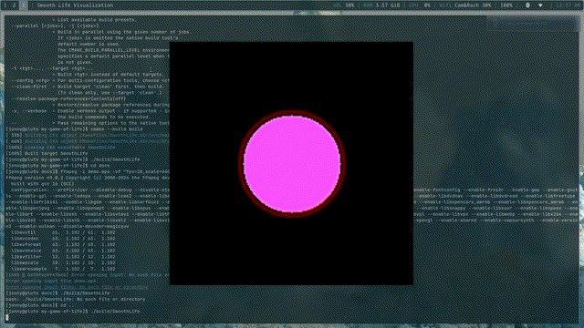

# SmoothLife Visualization
I've always been extremely fascinated by cellular automata ever since I first learned about Conway's Game of Life. I wasn't just interested about the complexity that arose from the very simple rules, but simply by how appealing the visualizations are. Then I discovered that there are so many different cellular automata that all looked even more interesting than Conway's, one in particular was SmoothLife not just because it looks awesome but because it seemed to be a very intuitive jump from Conway's game. For this project I wanted to visualize SmoothLife myself because it sounded fun but also because I wanted to know how it worked past the abstractions that I was given.

**Link to Rafler's paper:** https://arxiv.org/pdf/1111.1567
## Visuals:

## How It's Made:

**Tech used:** C++, SDL2, CMake

This project was implemented using C++ primarily because of my comfort level with the language as this project is just for myself. SDL2 was used as it is an extremely popular graphics library for C++ and I wasn't looking for something extremely optimal for my use case. CMake was chosen over a typical Makefile for improved portability of SDL2 over different Operating Systems.

## How to run:

**Dependencies:** C++, SDL2, CMake

For this visualization to run properly all of the dependencies need to be installed locally on your machine. Then you just need to build and run it through CMake by running:
```
cmake -B build
cmake --build build
./build/SmoothLife
````

## Future Additions / How I'd do it again

If I were to rewrite this it wouldn't be in C++ as SDL2 is nice but overcomplicated it a lttle bit and as the problem grows so quickly with grid size I would want the most efficient option. I would also add ways to specify in the cli certain seeds and grid size as it's fun to play around with those but modifying the source code is the worst possible way to go about it. But overall, I'd say the project was a success as I've gained a much greater understanding of what was intriguing me and I've got to play around with the cool visuals.
